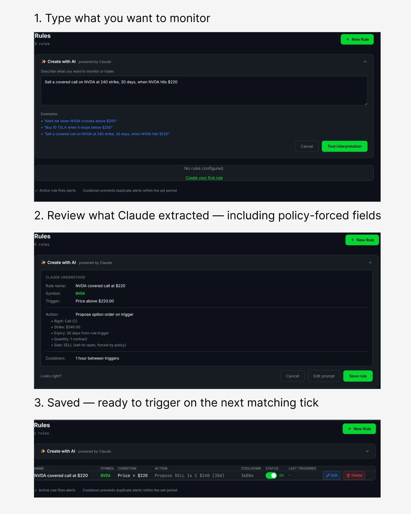
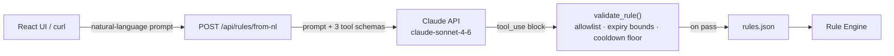
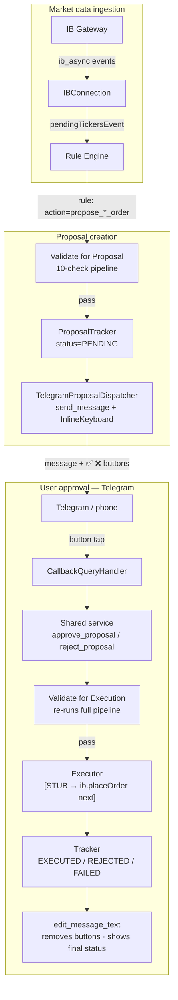
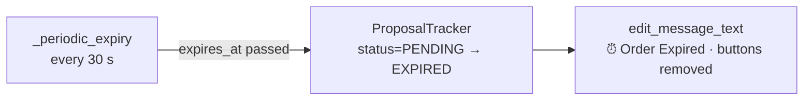
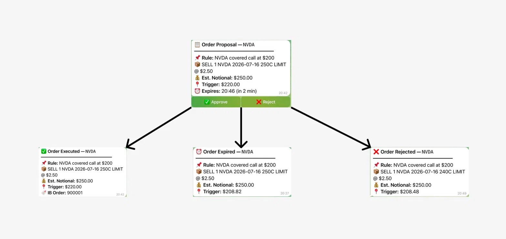
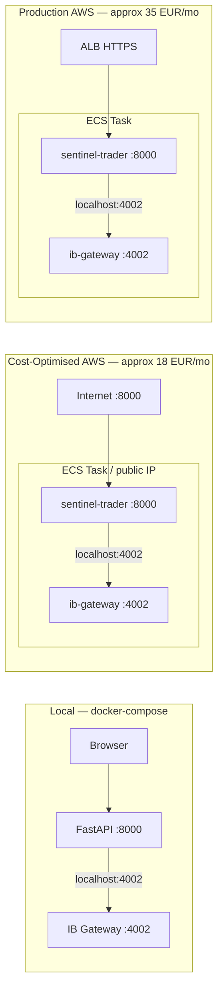

# SentinelTrader

A trading assistant that connects to Interactive Brokers via the TWS API. Real-time market data streams into an event-driven rule engine; rules can either fire Telegram alerts or generate order proposals requiring explicit approval before execution. Order proposals are delivered as Telegram messages with inline ✅ / ❌ buttons; the human taps approve, a 10-check validation pipeline runs, and a stub executor logs "WOULD EXECUTE" — wired for `ib.placeOrder()` in the next commit. Rules can be written via REST, a React UI, or plain English: a `/api/rules/from-nl` endpoint sends the user's prompt to the Claude API and validates the structured result before persisting.

Runs locally via `docker-compose` with IB Gateway as a sidecar container. Two CloudFormation configurations cover cost-optimised and production-grade AWS deployment — both have been deployed and validated; infrastructure is spun down for cost discipline and redeploys in under 20 minutes.

---

## Rule creation

Describe what you want to monitor in natural language; Claude parses it into a structured rule that you can review and adjust before saving.



The same rule could be written via REST API or the React form — Claude's parsing layer just makes it accessible without learning the schema.

---

## How it works

### Flow A — LLM rule creation



### Flow B — order proposal lifecycle (creation + approval)



### Flow C — expiry path (no user action)





---

## Deployment configurations



**Currently runs locally via `docker-compose`.** Both AWS configurations were deployed and validated on ECS Fargate (eu-west-1); infrastructure spun down for cost. Redeploys in under 20 minutes via `aws cloudformation deploy` (allow 3 additional minutes for IB Gateway 2FA approval on first login). See [`infra/PRODUCTION.md`](infra/PRODUCTION.md) for architecture comparison and cost breakdown.

---

## Tech stack

| Layer | Technology |
|---|---|
| Language / runtime | Python 3.11+, Node 20 |
| IB API | `ib_async` (async TWS API client) |
| Web framework | FastAPI, Uvicorn |
| Frontend | React 18, TypeScript, Vite, Tailwind CSS |
| Notifications | `python-telegram-bot` v22 — long-polling, inline keyboards, `CallbackQueryHandler` |
| LLM | Anthropic Python SDK — Claude claude-sonnet-4-6, tool-use API for rule parsing |
| Logging | `loguru` |
| Containerisation | Docker (multi-stage build), docker-compose |
| Infrastructure | AWS ECS Fargate, CloudFormation, ECR |
| IB Gateway | `ghcr.io/gnzsnz/ib-gateway` (IBC automation) |

---

## Capabilities

- Real-time quote streaming for a configurable list of symbols via `ib_async`; limited only by the IB market data line quota on the account (typically 100 lines)
- Rule engine evaluates price and volume conditions on every incoming `pendingTickersEvent` tick batch — no polling interval
- Per-rule cooldown (configurable, in seconds) prevents duplicate alerts on volatile tickers without blocking unrelated rules
- Dynamic symbol subscription at runtime: adding a rule for a new symbol subscribes market data without restarting the engine
- Full CRUD for rules via REST API and React UI; rules persist to `rules.json` between restarts
- Alert dispatch is channel-agnostic: the rule engine calls `dispatch_channel(channel_name, ...)` and has no knowledge of delivery channels
- Natural-language rule creation: `POST /api/rules/from-nl` accepts a plain-English prompt and produces a validated `Rule` via the Claude API. The LLM output is validated against the safety policy before any write; schema-violating or out-of-policy responses are rejected with a 400.
- Rules with `action.type: propose_stock_order` or `propose_option_order` generate order proposals rather than alerts. A 10-check validation pipeline ([`src/orders/validation.py`](src/orders/validation.py)) runs at proposal creation time and again at approval time (state may have drifted).
- Proposals are delivered to Telegram as messages with inline ✅ Approve / ❌ Reject buttons. The same `approve_proposal` / `reject_proposal` service ([`src/orders/service.py`](src/orders/service.py)) handles both HTTP route taps and Telegram button taps — no duplicated logic. When tapped, the original message edits in place to show the final status (✅ EXECUTED, ❌ REJECTED, ⏰ EXPIRED), and the buttons are removed.
- Proposals expire after a configurable window (default 3 minutes). A background task edits the Telegram message in place to "⏰ Order Expired" and removes the buttons.

See `docs/screenshots/` for Telegram message examples across PENDING, APPROVED & EXECUTED, REJECTED, and EXPIRED states.

---

## Engineering highlights

### Event-driven market data ingestion

`ib_async` fires `pendingTickersEvent` whenever IB delivers a tick batch. The rule engine registers a handler on this event and evaluates all rules for each affected symbol synchronously on arrival. There is no polling loop or sleep interval — evaluation latency is bounded only by IB's own tick delivery latency.

The alternative (polling `reqMktData` snapshots on a timer) would introduce a fixed evaluation lag equal to the polling interval and would miss rapid price moves between polls. The event model also handles multiple symbols with a single subscription loop rather than one polling task per symbol.

### TWS reconnection and stream recovery

Two separate paths can initiate the reconnect loop ([`src/core/connection.py:82-112`](src/core/connection.py#L82)):

1. **Initial startup failure**: if IB Gateway is not yet ready when the API starts, `connectAsync` raises and the lifespan handler calls `asyncio.create_task(conn._reconnect_loop())` directly ([`src/api/app.py:54`](src/api/app.py#L54)).
2. **Mid-session disconnect**: `disconnectedEvent` fires and `_on_disconnected` schedules a new `_reconnect_loop` task ([`src/core/connection.py:105-111`](src/core/connection.py#L105)).

Both paths converge on the same loop. On a successful reconnect, the registered callback calls `reqMarketDataType(1)` then `stream.resubscribe_all()`. Resubscription re-requests market data using the qualified contract objects already stored in `MarketDataStream.subscriptions` — no need to re-qualify contracts through IB, which avoids an extra round-trip and the possibility of contract resolution failing on reconnect.

### Proposal lifecycle and human-in-the-loop execution

Rules with `action.type: propose_stock_order` or `propose_option_order` generate a `Proposal` model rather than dispatching an alert. The proposal goes through a two-pass validation pipeline: once at creation time (pre-trade checks against current state) and once at approval time (state may have changed — IB may have disconnected, a daily order cap may have been hit, the proposal may have expired mid-wait).

The design is human-in-the-loop by intent, not by limitation. Fully autonomous order execution requires position sizing, risk limits, circuit breakers, and audit logging that are out of scope for a single-developer project. The architecture supports it — swapping the stub executor for `ib.placeOrder()` is a targeted change to [`src/orders/telegram_dispatcher.py`](src/orders/telegram_dispatcher.py). The human-in-the-loop constraint is held until those controls exist.

`TelegramProposalDispatcher` ([`src/orders/telegram_dispatcher.py`](src/orders/telegram_dispatcher.py)) sends a formatted message with an `InlineKeyboardMarkup`. When the user taps ✅ or ❌, PTB's `CallbackQueryHandler` fires `_on_proposal_callback` on the same event loop as the FastAPI server. Both the HTTP route and the Telegram callback call the same `approve_proposal` / `reject_proposal` functions in [`src/orders/service.py`](src/orders/service.py) — no duplicated state machine logic.

On any terminal transition (EXECUTED / REJECTED / FAILED / EXPIRED), `edit_message_text` updates the original message in place and removes the inline keyboard. The expiry path runs in a background `asyncio` task (`_periodic_expiry`, every 30 s) so proposals that are never acted on clean themselves up without user interaction.

### Natural-language rule creation

`POST /api/rules/from-nl` ([`src/api/routes/llm_rules.py`](src/api/routes/llm_rules.py)) accepts a plain-English prompt and produces a validated `Rule` using the Anthropic Python SDK and the tool-use API. Three tools are defined in [`src/llm/tools.py`](src/llm/tools.py) — `create_alert_rule`, `create_stock_order_rule`, `create_option_order_rule` — each with an `input_schema` describing the fields Claude must fill. Claude must call exactly one; the response is a `tool_use` block whose `input` is parsed directly into a `Rule`. If Claude responds with text instead (unsupported symbol, ambiguous quantity, clarification needed), the endpoint returns a 400 with that text as the detail.

The tool schemas are a first line of constraint: `create_option_order_rule` omits `side` and `order_type` entirely — the LLM cannot request a non-policy value for a field that doesn't exist in the schema. `validate_rule()` ([`src/llm/validator.py`](src/llm/validator.py)) is a second pass that re-checks the extracted rule against the same safety policy constants (`ALLOWED_SYMBOLS`, `MAX_OPTION_EXPIRY_DAYS`, `OPTION_SIDE_ALLOWED`) used by the pre-trade validation pipeline. In practice, Claude's output respects the schema constraints consistently; the validator catches the residual cases where a well-formed field value is still policy-violating — a symbol outside the allowlist, an expiry beyond the 60-day cap, or a cooldown below the 60-second floor.

The LLM is purely a parsing layer. Rules produced via this endpoint go through the same `engine.add_rule()` path, the same condition evaluators, and the same action dispatcher as rules created via the UI or REST API directly.

### Channel dispatch

Alert delivery is channel-agnostic: the rule engine calls `dispatch_channel(channel_name, ...)` and has no knowledge of specific delivery mechanisms. Adding an output channel — email, webhook, push notification — means implementing one handler function and adding one key to `_CHANNELS` ([`src/rules/actions.py`](src/rules/actions.py#L127)). The rule engine, condition evaluators, and API routes remain unchanged.

Current channels: `telegram`, `log`, `console`. `notify` is an alias for `telegram` for backwards compatibility with existing `rules.json` entries.

### Rule engine cooldown logic

Each `Rule` carries a `cooldown: int` (seconds) and a `last_triggered: datetime | None` field ([`src/rules/models.py`](src/rules/models.py)). Before dispatching, the engine calls `rule.is_on_cooldown()`, which computes wall-clock elapsed since `last_triggered` and returns `True` if the rule is still within its cooldown window. `mark_triggered()` records `datetime.now()`.

Two design decisions worth noting:

- **Cooldown state is in-memory only** — `last_triggered` is not written to `rules.json`. A process restart clears all cooldown state. This is intentional: stale cooldowns from a previous session should not suppress alerts after a restart or maintenance window.
- **Cooldown is per-rule, not per-symbol** — a symbol can have multiple rules with different cooldowns. A 5-minute price alert and a separate volume alert for the same ticker are independent.

### Dual deployment architecture

[`infra/cloudformation.yml`](infra/cloudformation.yml) is cost-optimised: a single ECS task with a dynamic public IP, no load balancer, single AZ — approximately €18/month. [`infra/production.yaml`](infra/production.yaml) adds an ALB with HTTPS termination, Route 53 DNS, multi-AZ subnets, CPU-based auto-scaling (min 1, max 3 tasks), and an optional WAF — approximately €35–40/month.

Both templates run IB Gateway as a sidecar container in the same ECS Task. In Fargate's `awsvpc` network mode, all containers in a task share one network namespace, so `sentinel-trader` connects to IB Gateway at `127.0.0.1:4002` — no port exposure outside the task required. The `deploy.sh` script handles ECR image build, push, and CloudFormation stack update in a single command.

See [`infra/PRODUCTION.md`](infra/PRODUCTION.md) for full architecture diagrams and cost breakdown.

### IB client ID scaling constraint

Each IB API connection requires a unique client ID. Horizontal scaling — running multiple ECS tasks — would require distinct `IbClientId` values per task and careful coordination around IB's session limit per account. The production template includes `MaxCapacity=3` for completeness, but a single-account deployment should set `MaxCapacity=1`. ECS service recovery (automatic task restart on container exit) provides the availability that matters for a single user. This constraint is documented in [`infra/PRODUCTION.md`](infra/PRODUCTION.md#a-note-on-scaling-and-ib-gateway).

### Proposal subsystem test coverage

The order proposal subsystem ships with 54 unit tests across [`tests/test_proposals.py`](tests/test_proposals.py) (18 covering state machine transitions, including invalid transition rejection) and [`tests/test_validation.py`](tests/test_validation.py) (36 covering individual checks, pipeline composition, and short-circuit ordering).

---

## Deployment

| Configuration | Command | Cost | Status |
|---|---|---|---|
| Local | `docker compose up --build` | Free | Primary demo path |
| Cost-Optimised AWS | `bash infra/deploy.sh` | ~€18/mo | Validated, spun down |
| Production AWS | See [`infra/PRODUCTION.md`](infra/PRODUCTION.md) | ~€35–40/mo | Validated, spun down |

Full AWS setup instructions, log access commands, and tear-down steps are in [`infra/README.md`](infra/README.md).

---

## Quick start (local)

**Prerequisites**

- Docker Desktop running
- An [IBKR Paper Trading account](https://www.interactivebrokers.com/en/trading/papertrading.html) — free to open, no funding required
- A Telegram bot token and chat ID ([create one via @BotFather](https://core.telegram.org/bots#botfather)) — required for alert delivery and proposal approval buttons
- An Anthropic API key — required only for natural-language rule creation

**Steps**

```bash
git clone https://github.com/law-cell/sentinel-trader.git
cd sentinel-trader

cp .env.example .env
```

Edit `.env` and add:

```bash
# IB Gateway credentials (required for docker-compose)
TWS_USERID=your_ib_username
TWS_PASSWORD=your_ib_password
TRADING_MODE=paper

# Telegram (required for alerts and proposal approval)
TELEGRAM_BOT_TOKEN=your_bot_token
TELEGRAM_CHAT_ID=your_chat_id

# Anthropic (required for /api/rules/from-nl)
ANTHROPIC_API_KEY=your_anthropic_key

# Connection settings (defaults work for local docker-compose)
IB_HOST=ib-gateway
IB_PORT=4002
IB_CLIENT_ID=1
```

```bash
docker compose up --build
```

On startup, IB Gateway will attempt to log in to IBKR. If your account has two-factor authentication enabled, approve the IBKR Mobile push notification within approximately 3 minutes. Once authenticated:

```
http://localhost:8000        # React dashboard
http://localhost:8000/docs   # FastAPI interactive docs
```

The dashboard shows IB connection status in the top bar. Add rules from the Rules page; alerts fire to Telegram when conditions are met. For rules with proposal actions, the Telegram message includes ✅ / ❌ buttons; tapping approve runs the validation pipeline and logs the execution.

**Adding rules via the API**

```bash
# Alert rule
curl -X POST http://localhost:8000/api/rules \
  -H "Content-Type: application/json" \
  -d '{
    "name": "NVDA intraday swing",
    "symbol": "NVDA",
    "condition": {"type": "price_change_pct", "threshold": 3.0},
    "channel": "telegram",
    "cooldown": 600
  }'

# Stock order proposal rule
curl -X POST http://localhost:8000/api/rules \
  -H "Content-Type: application/json" \
  -d '{
    "name": "Buy AAPL dip",
    "symbol": "AAPL",
    "condition": {"type": "price_below", "threshold": 180.0},
    "channel": "telegram",
    "action": {"type": "propose_stock_order", "side": "BUY", "quantity": 10, "order_type": "LIMIT", "limit_price": 178.00},
    "cooldown": 3600
  }'

# Natural-language rule creation
curl -X POST http://localhost:8000/api/rules/from-nl \
  -H "Content-Type: application/json" \
  -d '{"prompt": "alert me if NVDA drops more than 5% from yesterday'\''s close"}'
```

Available condition types: `price_above`, `price_below`, `price_change_pct` (signed % change from previous session's close — negative for drops), `volume_above`.

---

## Roadmap

### Real order execution (`ib.placeOrder`)

`TelegramProposalDispatcher.dispatch_execution()` currently logs "WOULD EXECUTE" and returns a mock `ib_order_id=900001`. The full approval and validation wiring is in place; replacing the stub with `ib.qualifyContracts()` + `ib.placeOrder()` is the next concrete step. Requires live TWS API testing and handling of partial fills, rejection codes, and position confirmation.

### Real option pricing

`get_option_mid_price()` ([`src/orders/pricing.py`](src/orders/pricing.py)) returns a fixed `$2.50`. Real implementation: qualify the option contract via `ib.qualifyContractsAsync()`, subscribe to market data briefly, read `ticker.bid` and `ticker.ask`, compute mid, then cancel the subscription. Edge cases: wide spread on illiquid strikes, no bid/ask available near expiry.

### PostgreSQL persistence

Replace `rules.json` with a PostgreSQL-backed store. Primary motivation: retain trigger history across restarts. Current in-memory ring buffer (100 events) resets on every process restart. A database also enables queries over historical alert data.

### Redis pub/sub

Decouple rule evaluation from alert dispatch using a Redis pub/sub channel. Evaluation publishes triggered rule events; a separate consumer handles delivery. This would allow multiple alert consumers without modifying the rule engine and is a prerequisite for any future multi-process or multi-tenant architecture.

---

## Known limitations

- **Order executor is stubbed** — `dispatch_execution()` logs "WOULD EXECUTE" and returns `ib_order_id=900001`. The proposal lifecycle, validation pipeline, and Telegram approval buttons are fully wired. Connecting real `ib.placeOrder()` is the next step.
- **Option pricing is stubbed** — `get_option_mid_price()` returns a fixed `$2.50`. The proposal notional estimate and the premium shown in the Telegram message use this value. Real IB market data for option contracts is future work.
- **Proposal state is in-memory** — a container restart drops all PENDING proposals. This is intentional: stale approval of a now-different world state is more dangerous than losing the proposal. It is documented behaviour, not an oversight.
- **Rule state resets on restart** — `last_triggered` is in-memory. Per-rule cooldown history clears on process restart.
- **IB market data line quota** — IB accounts have a maximum number of concurrent market data subscriptions (typically 100 for a paper account, varies by subscription tier). Subscribing to many symbols simultaneously against this limit will cause subscriptions to fail silently.
- **IB client ID constraint** — horizontal scaling of ECS tasks requires distinct client IDs per task. See [Engineering Highlights](#ib-client-id-scaling-constraint).
- **CORS is open** — `allow_origins=["*"]` in `src/api/app.py`. Appropriate for single-user local deployment; restrict to specific origins before multi-user use.
