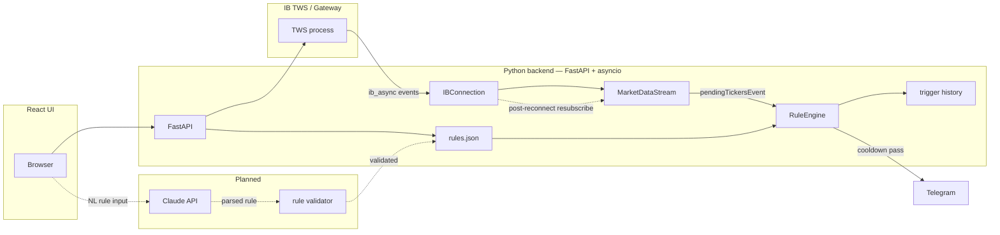
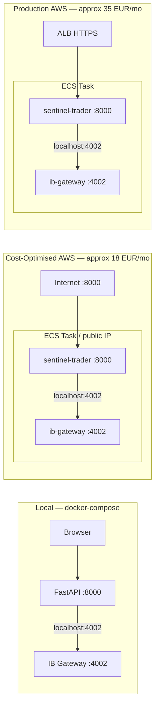

# SentinelTrader

A signal system that connects to Interactive Brokers via the TWS API: real-time market data streaming, an event-driven rule engine that evaluates price and volume conditions on every incoming tick, and Telegram alert dispatch. A React dashboard shows account state, open positions, and alert history.

Runs locally via `docker-compose` with IB Gateway as a sidecar container. Two CloudFormation configurations cover cost-optimised and production-grade AWS deployment — both have been deployed and validated; infrastructure is spun down for cost discipline and redeploys in under 20 minutes.

---

## How it works



_Dashed edges = planned, not yet implemented. See [Roadmap](#roadmap)._

---

## Deployment configurations



**Currently runs locally via `docker-compose`.** Both AWS configurations were deployed and validated on ECS Fargate (eu-west-1); infrastructure spun down for cost. Redeploys in under 20 minutes via `aws cloudformation deploy` (allow 3 additional minutes for IB Gateway 2FA approval on first login). See [`infra/PRODUCTION.md`](infra/PRODUCTION.md) for architecture comparison and cost breakdown.

---

## Tech stack

| Layer | Technology |
|---|---|
| Language / runtime | Python 3.11+, Node 20 |
| IB API | `ib_async` (async TWS API client) |
| Web framework | FastAPI, Uvicorn |
| Frontend | React 18, TypeScript, Vite, Tailwind CSS |
| Notifications | Telegram Bot API via `httpx` (async) |
| Logging | `loguru` |
| Containerisation | Docker (multi-stage build), docker-compose |
| Infrastructure | AWS ECS Fargate, CloudFormation, ECR |
| IB Gateway | `ghcr.io/gnzsnz/ib-gateway` (IBC automation) |

---

## Capabilities

- Real-time quote streaming for a configurable list of symbols via `ib_async`; limited only by the IB market data line quota on the account (typically 100 lines)
- Rule engine evaluates price and volume conditions on every incoming `pendingTickersEvent` tick batch — no polling interval
- Per-rule cooldown (configurable, in seconds) prevents duplicate alerts on volatile tickers without blocking unrelated rules
- Dynamic symbol subscription at runtime: adding a rule for a new symbol subscribes market data without restarting the engine
- Full CRUD for rules via REST API and React UI; rules persist to `rules.json` between restarts
- Alert dispatch is channel-agnostic: the rule engine calls `execute_action(rule.action, ...)` and has no knowledge of delivery channels

---

## Engineering highlights

### Event-driven market data ingestion

`ib_async` fires `pendingTickersEvent` whenever IB delivers a tick batch. The rule engine registers a handler on this event and evaluates all rules for each affected symbol synchronously on arrival. There is no polling loop or sleep interval — evaluation latency is bounded only by IB's own tick delivery latency.

The alternative (polling `reqMktData` snapshots on a timer) would introduce a fixed evaluation lag equal to the polling interval and would miss rapid price moves between polls. The event model also handles multiple symbols with a single subscription loop rather than one polling task per symbol.

### TWS reconnection and stream recovery

Two separate paths can initiate the reconnect loop (`src/core/connection.py:82-112`):

1. **Initial startup failure**: if IB Gateway is not yet ready when the API starts, `connectAsync` raises and the lifespan handler calls `asyncio.create_task(conn._reconnect_loop())` directly (`src/api/app.py:54`).
2. **Mid-session disconnect**: `disconnectedEvent` fires and `_on_disconnected` schedules a new `_reconnect_loop` task (`src/core/connection.py:105-111`).

Both paths converge on the same loop. On a successful reconnect, the registered callback (`src/api/app.py:75-82`) calls `reqMarketDataType(1)` then `stream.resubscribe_all()`. Resubscription re-requests market data using the qualified contract objects already stored in `MarketDataStream.subscriptions` — no need to re-qualify contracts through IB, which avoids an extra round-trip and the possibility of contract resolution failing on reconnect.

### Alert-only design

The rule engine dispatches alerts; it does not place orders. This is a deliberate design choice: position management decisions remain with the user. The system provides the signal; the human decides whether to act.

The dispatch site (`src/rules/actions.py:126-147`) maps action names to handler functions in a dict (`_ACTIONS`). The rule engine calls `execute_action(rule.action, ...)` and never references a specific channel. Adding an output channel — email, webhook, push notification — means implementing one handler function and adding one key to `_ACTIONS`. The rule engine, condition evaluators, and API routes remain unchanged.

Current channels: `telegram`, `log`, `console`. `notify` is an alias for `telegram` for backwards compatibility with existing `rules.json` entries.

### Rule engine cooldown logic

Each `Rule` carries a `cooldown: int` (seconds) and a `last_triggered: datetime | None` field (`src/rules/models.py`). Before dispatching, the engine calls `rule.is_on_cooldown()`, which computes wall-clock elapsed since `last_triggered` and returns `True` if the rule is still within its cooldown window. `mark_triggered()` records `datetime.now()`.

Two design decisions worth noting:

- **Cooldown state is in-memory only** — `last_triggered` is not written to `rules.json`. A process restart clears all cooldown state. This is intentional: stale cooldowns from a previous session should not suppress alerts after a restart or maintenance window.
- **Cooldown is per-rule, not per-symbol** — a symbol can have multiple rules with different cooldowns. A 5-minute price alert and a separate volume alert for the same ticker are independent.

### Dual deployment architecture

`infra/cloudformation.yml` is cost-optimised: a single ECS task with a dynamic public IP, no load balancer, single AZ — approximately €18/month. `infra/production.yaml` adds an ALB with HTTPS termination, Route 53 DNS, multi-AZ subnets, CPU-based auto-scaling (min 1, max 3 tasks), and an optional WAF — approximately €35–40/month.

Both templates run IB Gateway as a sidecar container in the same ECS Task. In Fargate's `awsvpc` network mode, all containers in a task share one network namespace, so `sentinel-trader` connects to IB Gateway at `127.0.0.1:4002` — no port exposure outside the task required. The `deploy.sh` script handles ECR image build, push, and CloudFormation stack update in a single command.

See [`infra/PRODUCTION.md`](infra/PRODUCTION.md) for full architecture diagrams and cost breakdown.

### IB client ID scaling constraint

Each IB API connection requires a unique client ID. Horizontal scaling — running multiple ECS tasks — would require distinct `IbClientId` values per task and careful coordination around IB's session limit per account. The production template includes `MaxCapacity=3` for completeness, but a single-account deployment should set `MaxCapacity=1`. ECS service recovery (automatic task restart on container exit) provides the availability that matters for a single user. This constraint is documented in [`infra/PRODUCTION.md`](infra/PRODUCTION.md#a-note-on-scaling-and-ib-gateway).

---

## Deployment

| Configuration | Command | Cost | Status |
|---|---|---|---|
| Local | `docker compose up --build` | Free | Primary demo path |
| Cost-Optimised AWS | `bash infra/deploy.sh` | ~€18/mo | Validated, spun down |
| Production AWS | See [`infra/PRODUCTION.md`](infra/PRODUCTION.md) | ~€35–40/mo | Validated, spun down |

Full AWS setup instructions, log access commands, and tear-down steps are in [`infra/README.md`](infra/README.md).

---

## Quick start (local)

**Prerequisites**

- Docker Desktop running
- An [IBKR Paper Trading account](https://www.interactivebrokers.com/en/trading/papertrading.html) — free to open, no funding required
- A Telegram bot token and chat ID ([create one via @BotFather](https://core.telegram.org/bots#botfather)) — optional but required for alert delivery

**Steps**

```bash
git clone https://github.com/law-cell/sentinel-trader.git
cd sentinel-trader

cp .env.example .env
```

Edit `.env` and add:

```bash
# IB Gateway credentials (required for docker-compose)
TWS_USERID=your_ib_username
TWS_PASSWORD=your_ib_password
TRADING_MODE=paper

# Telegram (required for alert delivery)
TELEGRAM_BOT_TOKEN=your_bot_token
TELEGRAM_CHAT_ID=your_chat_id

# Connection settings (defaults work for local docker-compose)
IB_HOST=ib-gateway
IB_PORT=4002
IB_CLIENT_ID=1
```

```bash
docker compose up --build
```

On startup, IB Gateway will attempt to log in to IBKR. If your account has two-factor authentication enabled, approve the IBKR Mobile push notification within approximately 3 minutes. Once authenticated:

```
http://localhost:8000        # React dashboard
http://localhost:8000/docs   # FastAPI interactive docs
```

The dashboard shows IB connection status in the top bar. Add rules from the Rules page; alerts fire to Telegram when conditions are met.

**Adding rules via the API**

```bash
curl -X POST http://localhost:8000/api/rules \
  -H "Content-Type: application/json" \
  -d '{
    "name": "NVDA intraday swing",
    "symbol": "NVDA",
    "condition": {"type": "price_change_pct", "threshold": 3.0},
    "action": "telegram",
    "cooldown": 600,
    "enabled": true
  }'
```

Available condition types: `price_above`, `price_below`, `price_change_pct` (absolute % change from previous session's close), `volume_above`.

---

## Roadmap

### Natural-language rule creation via Claude API

Planned: a `/api/rules/nl` endpoint that accepts a natural-language rule description and creates a structured rule via the Claude API.

Intended flow:
1. User submits a prompt: _"alert me if NVDA drops more than 5% from yesterday's close"_
2. FastAPI sends the prompt to the Claude API with the existing `RuleCreate` schema as a JSON schema constraint
3. Claude returns a structured rule object
4. The response is validated against `RuleCreate` with Pydantic before any write occurs — invalid or schema-violating LLM output is rejected with a 422 and the raw response returned for inspection
5. On validation pass, the rule is persisted via the standard `engine.add_rule()` path

The LLM is purely a parsing layer. All rule execution goes through the same condition evaluator and action dispatcher as form-created rules.

### PostgreSQL persistence

Replace `rules.json` with a PostgreSQL-backed store. Primary motivation: retain trigger history across restarts. Current in-memory ring buffer (100 events) resets on every process restart. A database also enables queries over historical alert data.

### Redis pub/sub

Decouple rule evaluation from alert dispatch using a Redis pub/sub channel. Evaluation publishes triggered rule events; a separate consumer handles delivery. This would allow multiple alert consumers without modifying the rule engine and is a prerequisite for any future multi-process or multi-tenant architecture.

---

## Known limitations

- **Rule state resets on restart** — `last_triggered` is in-memory. Per-rule cooldown history clears on process restart.
- **IB market data line quota** — IB accounts have a maximum number of concurrent market data subscriptions (typically 100 for a paper account, varies by subscription tier). Subscribing to many symbols simultaneously against this limit will cause subscriptions to fail silently.
- **IB client ID constraint** — horizontal scaling of ECS tasks requires distinct client IDs per task. See [Engineering Highlights](#ib-client-id-scaling-constraint).
- **CORS is open** — `allow_origins=["*"]` in `src/api/app.py`. Appropriate for single-user local deployment; restrict to specific origins before multi-user use.
- **Alert-only** — the rule engine dispatches Telegram alerts. No orders are placed. Position management is manual.
- **Test coverage** — the repository contains a manual integration test for Telegram delivery (`tests/test_telegram.py`). Unit tests for condition evaluators and the reconnect loop are on the roadmap.
